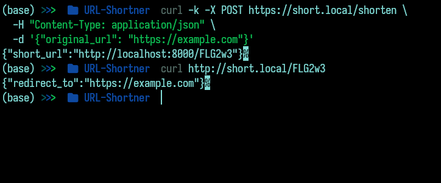

# URL Shortener Kubernetes Project

A fully Dockerized, Kubernetes-deployed, backend-only URL shortener built using **FastAPI**, running with **Ingress**, **self-signed TLS**, and **Cert-Manager**.

---

## Features

* RESTful API to shorten and redirect URLs
* Dockerized and deployed via Kubernetes
* Ingress support with clean URLs (`http://short.local/...`)
* Self-signed HTTPS with Cert-Manager

---

## Tech Stack

* **Backend**: Python + FastAPI
* **Containerization**: Docker
* **Orchestration**: Kubernetes (via Minikube)
* **Networking**: Ingress NGINX
* **TLS**: Cert-Manager (self-signed certs)

---

## 🛠️ Step-by-Step Installation

### 1. Install Required Tools

* [Docker](https://docs.docker.com/get-docker/)
* [Minikube](https://minikube.sigs.k8s.io/docs/start/)
* [kubectl](https://kubernetes.io/docs/tasks/tools/)

---

### 2. Start Minikube and Use Minikube's Docker

```bash
minikube start
eval $(minikube docker-env)
```

---

### 3. Build Docker Image (inside Minikube)

```bash
docker build -t url-shortener:latest .
```

---

### 4. Set Host Entry for Domain

Find Minikube IP:

```bash
minikube ip
```

Edit `/etc/hosts` file (Linux/macOS):

```bash
sudo nano /etc/hosts
```

Add this line:

```
<MINIKUBE_IP> short.local
```

---

### 5. Enable Ingress Addon

```bash
minikube addons enable ingress
```

---

### 6. Apply All Kubernetes Resources

```bash
kubectl apply -f k8s.yaml
```

---

### 7. Install Cert-Manager

```bash
kubectl apply -f https://github.com/cert-manager/cert-manager/releases/download/v1.14.2/cert-manager.yaml
```

Wait 30s, then check:

```bash
kubectl get pods -n cert-manager
```

All should be in `Running`.

---

### 8. Access Application

#### Shorten a URL:

```bash
curl -X POST http://short.local/shorten \
  -H "Content-Type: application/json" \
  -d '{"original_url": "https://example.com"}'
```

#### Redirect:

```bash
curl http://short.local/<short-code>
```



---

## 🔐 Access with HTTPS

Navigate to:

```url
https://short.local/shorten
```

You’ll get a browser warning (self-signed cert). Click "Advanced → Proceed".

---

## Cleanup

```bash
kubectl delete -f k8s.yaml
minikube stop
```

---

## 📁 Suggested Folder Structure

```bash
.
├── app
│   └── main.py
├── Dockerfile
├── k8s
│   ├── certificate.yaml
│   ├── clusterissuer.yaml
│   ├── deployment.yaml
│   ├── ingress.yaml
│   └── service.yaml
└── requirements.txt

3 directories, 8 files
```
